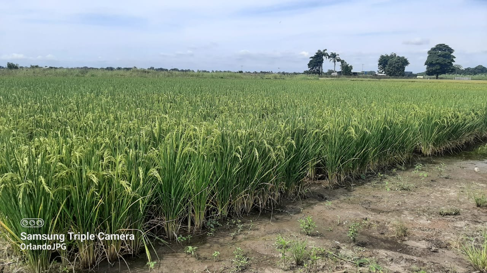
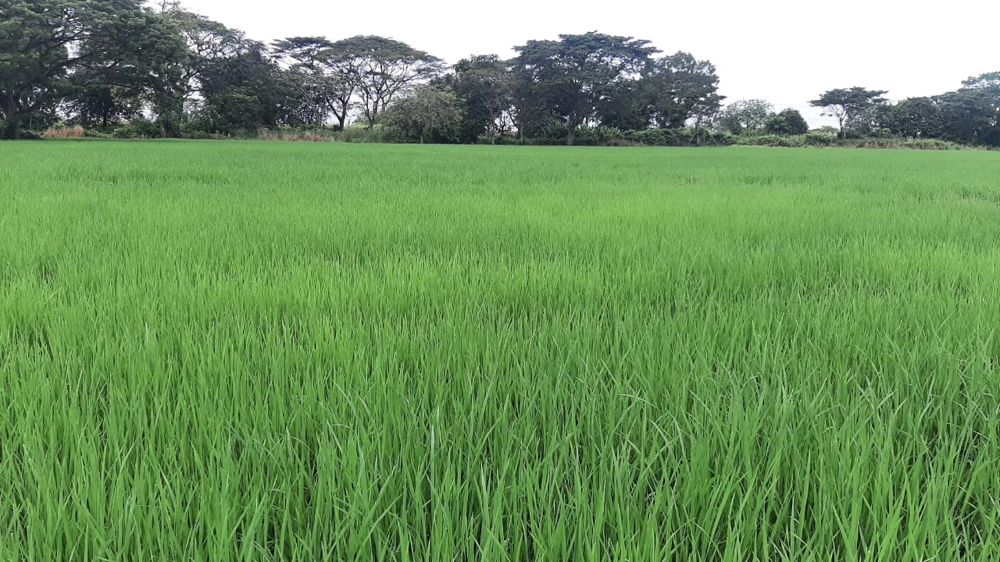
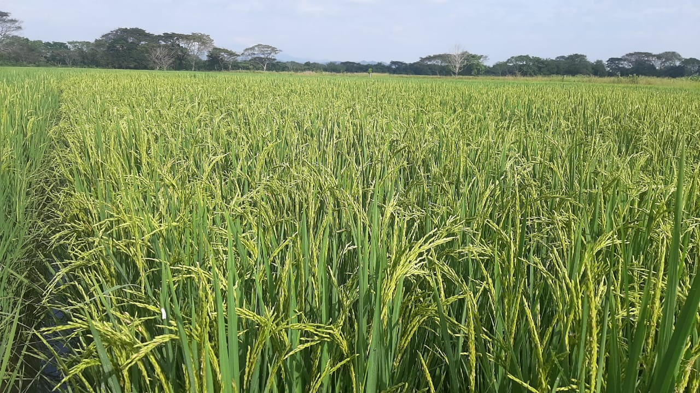

Rif: J-08507040-0

------------------------------------------------------------------------

# SUPREMA-FL

------------------------------------------------------------------------

## Gerencia de Tecnología y Desarrollo

**Ing. Yuraima Mendoza,** *Fitomejoradora*

**Ing. Orlando Pérez,** *Gerente de Tecnología y Desarrollo*

*Acarigua, diciembre del 2024*

------------------------------------------------------------------------

## Características de la nueva variedad de arroz y su referencial de manejo agronómico.

Les presentamos a todos los productores de arroz de Venezuela nuestra nueva variedad de arroz ***SUPREMA FL*** la cual presentan características interesantes que la diferencia del resto de las variedades comerciales que están disponibles en mercado.

La variedad ***SUPREMA FL***, proviene del cruce de FL05512-7P-6-1P/FL02066-4P-1-1P-2P-M-1P-M-M-M-F11//FL04574-1P-4-3P-1P-M y tiene por *Pedigree FL08310-4P-1-3P-3P-M-2PY-M*.

Fue obtenida en el ***Fondo Latinoamericano de Arroz de Riego*** (FLAR) durante las generaciones segregantes F2 a F5; luego fue seleccionada y desarrollada la fitomejoradora Ing. ***Yubiry Mujica*** en el programa de mejoramiento de la ***Asociación de Productores de Semilla Certificada de los Llanos Occidentales*** (APROSCELLO) con el apoyo de la ***Fundación Nacional del Arroz*** (FUNDARROZ).

------------------------------------------------------------------------

### **Características agronómicas**

| Característica                   |        Descripción        |
|----------------------------------|:-------------------------:|
| Altura de la planta (cm)         |         98 - 105          |
| Ciclo                            | Intermedio (115-120 días) |
| Hábito de crecimiento            |       Semi-compacto       |
| Macollamiento                    |      Buena capacidad      |
| Color de la hoja                 |           Verde           |
| Reacción al desgrane             |   Moderadamente difícil   |
| Reacción al volcamiento          |        Resistente         |
| Tallo                            |     Fuerte y flexible     |
| Fertilidad (%)                   |       90.58 - 97.51       |
| Nº de Granos por panícula        |         176 - 237         |
| Longitud de la panícula (cm)     |        23.5 - 32.1        |
| Retraso a cosecha                |        Resistente         |
| Potencial de rendimiento (TN/ha) |      Superior a 8,5       |

------------------------------------------------------------------------

### **Reacción a plagas y enfermedades**

| Especie/Patógeo                                          | Comportamiento |
|----------------------------------------------------------|:--------------:|
| Piricularia hoja (*Pyricularia oryzae* )                 |     0 - 3      |
| Piricularia cuello (*Pyricularia oryzae* )               |     0 - 3      |
| Helminthosporiosis en hoja (*Helminthosporium oryzae*)   |     0 - 3      |
| Helminthosporiosis en cuello (*Helminthosporium oryzae*) |     0 - 3      |
| Escaldado (*Rhynchosporium oryzae*)                      |     0 - 3      |
| Manchado del grano                                       |     0 - 3      |
| Virus Hoja Blanca                                        |     0 - 5      |
| Sogata (*Tagosodes orizicolus*)                          |     0 - 3      |

> La escala de medición va desde 0 a 9.
>
> -   0 significa que no presentó síntomas y es resistente.
>
> -   9 es altamente susceptible.

------------------------------------------------------------------------

### Características de la semilla

| **Característica**         | **Descripción**   |
+----------------------------+---------------+
| Longitud (mm)              | 9.0 - 11.0    |
+----------------------------+---------------+
| Ancho (mm)                 | 2.0 - 3.0     |
+----------------------------+---------------+
| Espesor (mm)               | 2.0           |
+----------------------------+---------------+
| Arista                     | Ausente       |
+----------------------------+---------------+
| Peso de 1000 semillas (gr) | 24.0 - 28.0   |
+----------------------------+---------------+

------------------------------------------------------------------------

## **REFERENCIAL DE MANEJO AGRONÓMICO**

El *Referencial de Manejo Agronómico de la variedad **SUPREMA FL*** constituye una guía imprescindible para garantizar para optimizar su manejo y ayudará a que el productor alcance altos rendimientos. Recomendamos que tanto agrotécnicos como los productores estudien con detenimiento cada una de estas recomendaciones que aun cuando son de carácter general, resultan suficientes como base orientadora para la toma de decisiones en cada fase y etapa del desarrollo del cultivo.

### **Densidad de siembra**

En nuestras evaluaciones experimentales y semicomerciales se determinó que la SUPREMA FL puede ser manejada bajo diferentes densidades de siembra, sin embargo, para definir la cantidad de semilla por hectárea recomendamos sopesar la modalidad de siembra a implementar; a continuación hacemos las consideraciones pertinentes para cada sistema.

#### ***Sistema de barro batido y semilla pregerminada***

Al igual que otras variedades comerciales, recomendamos que el pregerminado se realice dándole una primera fase de remojo que puede durar entre 24 a 36 horas; una vez completado este paso, se inicia una segunda fase que consiste en sacar la semilla del agua y colocarla bajo sombra durante un tiempo no menor de 24 horas y no mayor de 26 horas, al finalizar esta segunda fase, la semilla estará lista la siembra. Consideramos que el productor que utiliza este sistema de barro batido maneje densidades de entre 90 y 120 kg/ha de semilla certificada. Bajo nuestra experiencia a nivel comercial le damos preferencia a usar 100 kg/ha de semilla certificada.

#### ***Sistemas de labranza en suelo seco y otros alternativas***

En sistemas de labranza reducida o conservacionista, recomendamos densidades de entre los 60 y 90 kg/ha de semilla certificada; algunas consideraciones importantes son las siguientes:

-   Profundidad de siembra en 2,5 cm de promedio y que ésta no sea mayor a 3 cm.

-   Si la siembra es bajo el esquema de semilla tapada con rastra de tiro, se recomendamos incrementar entre un 5 % a 7 % la densidad con el propósito de compensar la pérdida por las semillas que queden muy profunda y no son capaces de emerger.

------------------------------------------------------------------------

### **Control de malezas**

El control de malezas es un componente fundamental del manejo integral del cultivo y una pregunta frecuente es si la nueva variedad presenta algún problema de fitotoxicidad a las moléculas de herbicidas que se utilizan en el cultivo de arroz, por esta razón hemos sometido a evaluación el comportamiento de la ***SUPREMA FL*** frente a las principales moléculas de herbicidas utilizando las dosis recomendadas. Durante la implementación de las pruebas se realizaron aplicaciones en condiciones de ambiente controlado, así como en parcelas semicomerciales para validar en condiciones de campo; se consideraron testigos absolutos y mezclas tradicionales de herbicidas con preemergentes, postemergentes, de contacto y sistémicos. Como resultado se pudo observar que la variedad ***SUPREMA FL*** no mostró problemas de fitotoxicidad ni afecciones en el desarrollo normal del cultivo.

A continuación algunos tips generales que son de importancia en el control de malezas:

-   Cuando se utilice semilla pregerminada, se recomienda que los controles de malezas se realicen en pre-emergencia temprana, esto es, entre los 5 y 10 dds (días después de la siembra).

-   En el caso de usar semilla seca (no pregerminada) es completamente viable realizar aplicaciones de control de malezas entre los primeros 3 días antes de la emergencia; sin embargo, es importante que la decisión sea avalada por un técnico que verifique el estado de avance de la etapa de germinación para no salirse del momento óptimo de aplicación.

-   Recuerde que en mezcla donde estén presentes *propaniles* no deben agregarse o mezclarse insecticidas ***fosforados*** o ***carbamatos***.

------------------------------------------------------------------------

### **Manejo de la fertilización**

La fertilización es unas de las labores más importantes debido que está asociada al óptimo desarrollo del cultivo y a garantizar la mayor expresión del potencial de rendimiento del cultivo de arroz. Durante la etapa de desarrollo de la variedad ***SUPREMA FL***, nos esforzamos en obtener el patrón de extracción de nitrógeno, fósforo y potasio por vía indirecta. Esto quiere decir que las cantidades NPK extraidas por la variedad son estimaciones y que el un futuro cercano obtendremos los valores más precisos y, por su puesto, serán publicados oportunamente.

Recomendamos no improvisar en el diseño y la aplicación del plan de fertilización a fin de garantizar la mejor nutrición posible y lograr el uso eficiente de los fertilizante. La base para armar el plan es partir de un análisis de suelo que permita conocer sus propiedades físico-químicas, así mismo considerar la interacción entre la fecha de aplicación (momento oportuno), el tipo de nutriente o elemento a aplicar y las dosis por hectárea que se definan de todo este análisis.

Nos atrevemos a proponer una plan de fertilización de referencia tomando en cuenta los resultados de los ensayos realizados en cada zona y la demanda de NPK específica mostrada por la variedad, sin embargo, no olvide realizar una análisis riguroso de la información para ajustar los niveles de enmienda.

------------------------------------------------------------------------

**Tabla base para estimar necesidades nutricionales de la variedad *SUPREMA FL***

| Elemento           | Cantidad kg/ha |
|--------------------|:--------------:|
| Nitrógeno (N)      |   160 a 180    |
| Fósforo (P~2~O~5~) |    25 a 31     |
| Potasio (K~2~O)    |   135 a 165    |

------------------------------------------------------------------------

**1ra. Propuesta de fertilización con fósforo y potasio incorporados y dos reabonos**

| Momento                             | Fuente             | Elementos     |  Cantidad   |
|-------------------------------------|--------------------|---------------|:-----------:|
| Presiembra incorporado              | Fósfoto diamónico  | Fósforo (P)   | Todo (100%) |
| Presiembra incorporado              | Cloruro de potasio | Potasio (K)   | Todo (100%) |
| Reabono entre los 16 a 20 dds o dde | Urea               | Nitrógeno (N) |     60%     |
| Reabono entre los 40 a 45 dds o dde | Urea               | Nitrógeno (N) |     40%     |

> Nota: para determinar la edad del cultivo debe considerar el tipo de siembra
>
> dds = días después de la siembra;
>
> dde = días después de la emergencia

------------------------------------------------------------------------

**2da. Propuesta de fertilización en base a la modalidad tradicional**

| Momento                             | Fuente             | Elementos     | Cantidad |
|-------------------------------------|--------------------|---------------|:--------:|
| Básica entre los 25 a 30 dds o dde  | Fórmula completa   | Nitrógeno (N) |   20%    |
|                                     |                    | Fósforo (P)   |   Todo   |
|                                     |                    | Potasio (P)   |   20%    |
| Reabono entre los 25 a 32 dds o dde | Urea               | Nitrógeno (N) |   45%    |
|                                     | Cloruro de potasio | Potasio (K)   |   80%    |
| Reabono a los 45 dds o dde          | Urea               | Nitrógeno (N) |   40%    |

> dds = días después de la siembra;
>
> dde = días después de la emergencia

------------------------------------------------------------------------

Las cantidades de fertilizante expresadas en porcentaje (%) del total respectivo, no es una camisa de fuerza, sin embargo, debe usarse cantidades que se acerquen a esos valores, entendiendo que todo va a depender del total requerido por nutriente y la proporción del mismo presente en la fuente utilizada y el manejo del riego.

Es importante resaltar que consideramos que si por razones de logística la última enmienda de ***nitrógeno*** no se pudiera aplicar antes de la etapa de elongación, se recomienda esperar que esta etapa termine para poder realizarla, esto evitará que la planta crezca en altura por encima de su promedio lo que induciría a condiciones favorables para el acame o vuelco. Igual consideración debe tenerse en caso que el técnico recomiende suplir un adicional de nitrógeno.

A continuación agregamos información complementaria sobre la fertilización:

-   **Nitrógeno (N):** No aplicar menos de 160 unidades/ha; no perder de vista la relación 1:1 con el potasio (K).

-   **Fósforo (P):** el cultivar mostró que para alcanzar un rendimiento superior a las 8 toneladas/ha, requirió la absorción de 31 kg/ha de P~2~O~5~, en base a esta información se recomienda un promedio de 22 unidades/ha de P~2~O~5~, sin embargo, esta cantidad debe ser ajustada en función de la disponibilidad del elemento en el suelo.

-   **Potasio (K):** este elemento está relacionado con la sanidad integral del cultivar, la producción de materia seca y su potencial de rendimiento. El patrón de extracción determinado indirectamente mostró que las mejores respuestas en rendimiento de grano se alcanzaron con enmiendas de entre los 115 y 122 kg/ha de K~2~O; resaltamos que se pondere su aplicación en base al análisis de suelo y la dinámica del elemento en su relación con el nitrógeno (N) y el magnesio (Mg).

-   **Calcio, Magnesio y Azufre:** estos tres elementos juegan un importante papel dentro del desarrollo del cultivo y es importante considerar su enmienda para garantizar su equilibrio. Sin embargo, debemos que señalar que no ha sido posible determinar sus patrones de extracción, por lo que lo recomendado a continuación se basa en referencias de otros trabajos similares en arroz.

    -   Calcio: entre 11 y 16 kg/ha de Ca, preferiblemente con la fertilización básica.

    -   Magnesio: entre 8 y 12 kg/ha de Mg en la fertilización básica o en el primer reabono.

    -   Azufre: 16 y 22 kg/ha de S; preferiblemente en el primer reabono.

------------------------------------------------------------------------

### **Manejo de enfermedades**

La variedad ***SUPREMA FL*** fue evaluada con el rigor necesario en diferentes ambientes para conocer su comportamiento frente a las enfermedades fungosas más importantes del país (ver el apartado *Reacción frente a plagas y enfermedades)*. Aun cuando su desempeño fue muy bueno frente a los patógenos más importantes, es necesario tener presente que ante las variaciones climáticas que se están presentando en los últimos años hay que estar atentos a las diferentes síntomas que se puedan presentar y recomendamos que durante los meses del año donde se registran constantes precipitaciones y altas temperaturas, se realice, bajo asesoría técnica, protecciones preventivas con fungicidas dirigidas a garantizar la sanidad integral de cultivo y en especial de las panículas, de esta manera se evitaría posibles brotes del complejo de patógenos responsable del manchado de granos.

------------------------------------------------------------------------

{width="1280"}

------------------------------------------------------------------------

### **Manejo del riego**

La variedad **SUPREMA** ***FL*** no demanda el establecimiento de láminas de agua por largos periodos de tiempo. Al igual las demás variedades que se comercializan en la actualidad, puede ser manejada con mojes en la fase vegetativa y solo durante las etapas correspondiente a la fase reproductiva recomendamos que se establezca la lámina para garantizar el normal desarrolla de las etapas de emergencia de panículas, floración, grano lechoso y grano pastoso. Estas etapas son críticas para definir un buen llenado y calidad de grano y debe evitarse el mínimo estrés hídrico, de lo contrario pudiera generase vaneamiento en el grano.

------------------------------------------------------------------------

### **Cosecha**

***SUPREMA FL*** puede tolerar retrasos a la cosecha, siendo una característica importante por los diferentes factores que pueden interferir al momento de ejecutar la recolección del grano (lluvia, logística de cosecha, accidentes de maquinaria entre otros). La humedad del grano ideal para la recolección debe estar entre 22% y 20%.

Recomendamos que se revise periódicamente la calibración de la cosechadora combinada para reducir las pérdidas que con frecuencia suceden durante esta importante tarea.

------------------------------------------------------------------------

Si tiene preguntas o dudas sobre la información de manejo de la ***SUPREMA FL*** o simplemente quiere ampliarla, no dude en hacer contacto con nuestros especialistas; puede consultarnos a los correos:

-   [aproscello\@gmail.com](mailto:aproscello@gmail.com)

-   [orlandoinvestiga\@gmail.com](mailto:orlandoinvestiga@gmail.com)

    ... y con mucho gusto le atenderemos.

::: {#logofinal .logos layout-ncol="2"}
{fig-align="center" width="119"}
:::

::: {#yuraima .investigador}
**Ing. Yuraima Mendoza**

*Fitomejoradora*
:::

::: {#orlando .investigador}
**Ing. Msc. Orlando Pérez**

*Gerentecia de Tecnología y Desarrollo*
:::
